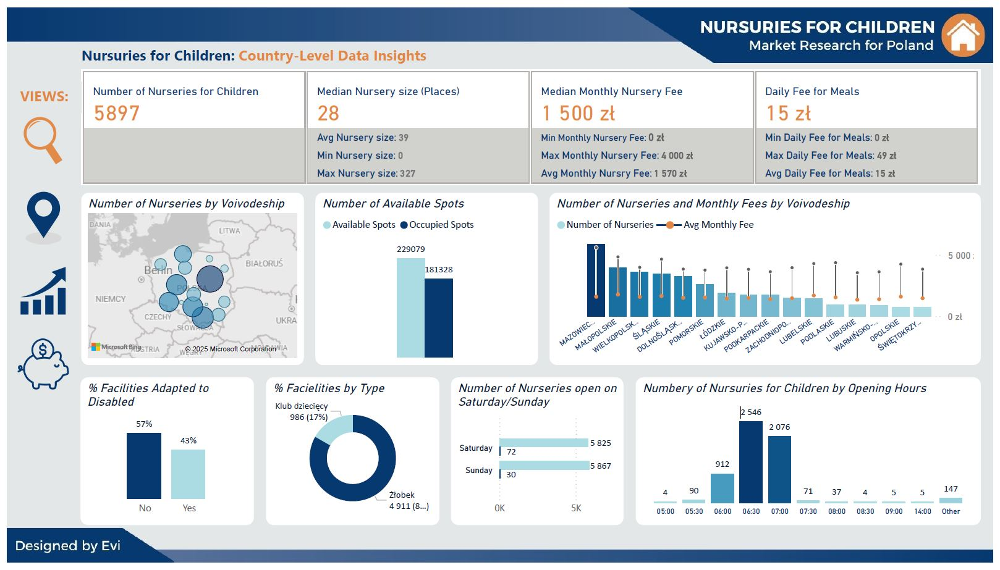
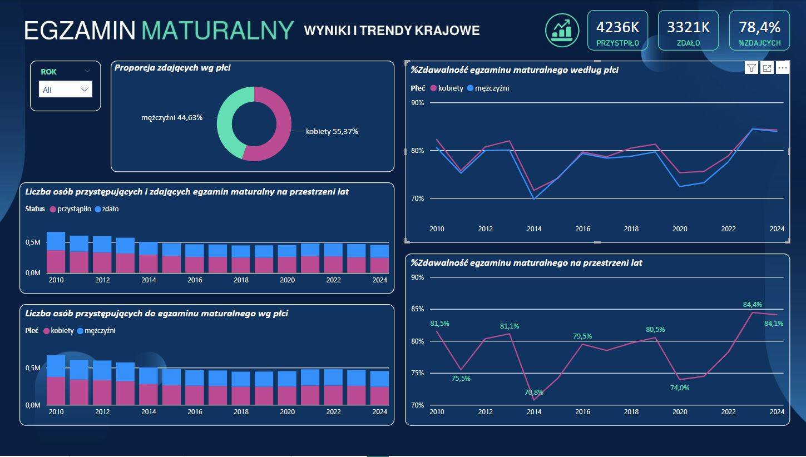
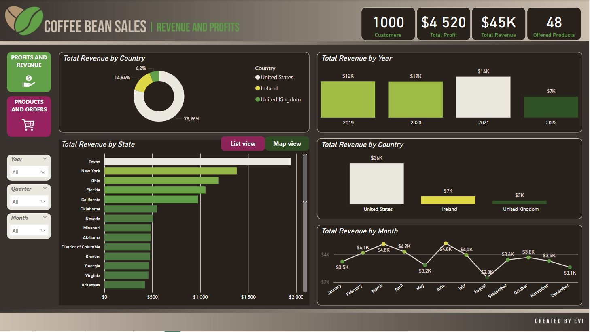

# /About/

Hi, my name is Ewa. I am an experienced Application Support Analyst, a fan of new technologies, a plant enthusiast, and an aspiring data analyst.
  
For the past 10 years, I have been professionally solving technical issues related to systems and applications in large financial sector companies.  
In my daily work, I use SQL and work with databases to deliver solutions for end users. I also have experience in database querying, troubleshooting, and debugging to ensure the smooth operation of business-critical applications. 

  Currently transitioning into Data Analytics, combining strong <B>SQL</B> expertise, analytical problem-solving skills, and a deep understanding of data collection, organization, and analysis to extract meaningful insights. Proficient in <B>Excel</B>, <B>Power BI</B>, <B>DAX</B>, and <B>graphic applications</B>, with expertise in report and dashboard creation, automation, data mining, data integration, and critical thinking to drive data-driven decision-making. 
 
 
# /Portfolio Projects/
 ## Analysis of the availability and costs of nurseries for children in Poland
  *<a href="https://analysteva.github.io/Project1-/"> Nursuries for Children in Poland Project</a>*
  
 

   
 ## Analysis of High School Exam Pass Rates in Poland - Matura
  *<a href="https://analysteva.github.io/Project1-/"> Matura Exam Pass Rates in Poland Project </a>*
  
  
 ## Analysis of the Coffee Been Sales
  *<a href="https://analysteva.github.io/Project1-/"> Cofee Bean Sales Project </a>*
  

<!--
## Projects
### Data Professional Survery Breakdown 
<a href="https://github.com/analysteva/Project1-.git">Project 1</a>

<a href="https://analysteva.github.io/Project1-/">Project 2</a> 
-->
