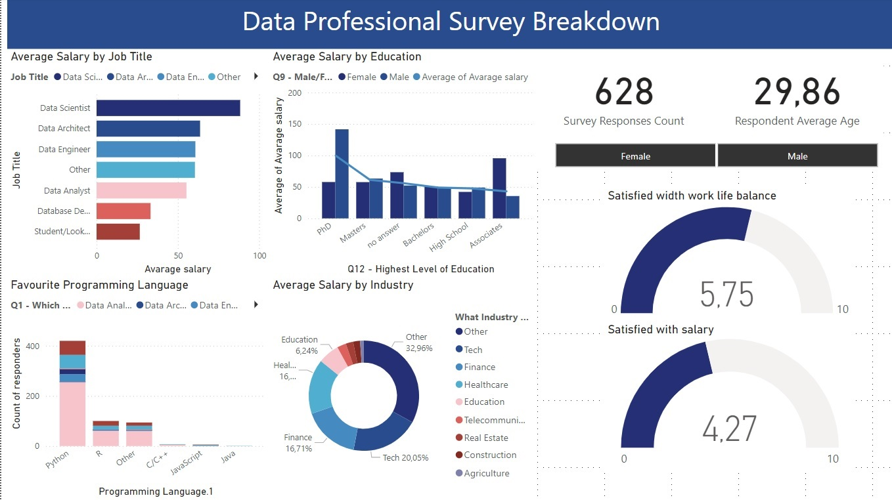

# About

Hi, my name is Ewa. I am an experienced application support analyst, a fan of new technologies, a plant enthusiast, and an aspiring data analyst. 
  
For the past 10 years, I have been professionally solving technical issues related to systems and applications in large financial sector companies. In my daily work, I use SQL and work with databases to deliver solutions for end users. I also have experience in database querying, troubleshooting, and debugging to ensure the smooth operation of business-critical applications. 

  Currently transitioning into Data Analytics, combining strong <B>SQL</B> expertise, analytical problem-solving skills, and a deep understanding of data collection, organization, and analysis to extract meaningful insights. Proficient in <B>Excel</B>, <B>Power BI</B>, <B>DAX</B>, and <B>graphic applications</B>, with expertise in dashboard creation, report automation, data mining, data integration, and critical thinking to drive data-driven decision-making. 

## Portfolio Projects
- Analysis of the availability and costs of nurseries for children in Poland  
    <a href="https://analysteva.github.io/Project1-/"> Nursuries for Children in Poland Project </a> 
    
- Analysis of High School Exam Pass Rates in Poland - Matura  
  <a href="https://analysteva.github.io/Project1-/"> Matura Exam Pass Rates in Poland Project </a>
  
- Analysis of the Coffee Been Sales  
  <a href="https://analysteva.github.io/Project1-/"> Cofee Bean Sales Project </a> 

  

## Work Experience
**Data Scientist @ Toyota Financial Services (_June 2022 - Present_)**
- Uncovered and corrected missing step in production data pipeline which impacted over 70% of active accounts
- Redeveloped loan originations model which resulted in 50% improvement in model performance and saving 1 million dollars in potential losses

**Data Science Consultant @ Shawhin Talebi Ventures LLC (_December 2020 - Present_)**
- Conducted data collection, processing, and analysis for novel study evaluating the impact of over 300 biometrics variables on human performance in hyper-realistic, live-fire training scenarios
- Applied unsupervised deep learning approaches to longitudinal ICU data to discover novel sepsis sub-phenotypes

## Projects
### Data Professional Survery Breakdown 
<a href="https://github.com/analysteva/Project1-.git">Project 1</a>

<a href="https://analysteva.github.io/Project1-/">Project 2</a> 

Technologies: Excel, Bower BI
Developed objective strategy for discovering optimal EEG bands based on signal power spectra using **Python**. This data-driven approach led to better characterization of the underlying power spectrum by identifying bands that outperformed the more commonly used band boundaries by a factor of two. The proposed method provides a fully automated and flexible approach to capturing key signal components and possibly discovering new indices of brain activity.

### Decoding Physical and Cognitive Impacts of Particulate Matter Concentrations at Ultra-Fine Scales
[Publication](https://www.mdpi.com/1424-8220/22/11/4240)

Used **Matlab** to train over 100 machine learning models which estimated particulate matter concentrations based on a suite of over 300 biometric variables. We found biometric variables can be used to accurately estimate particulate matter concentrations at ultra-fine spatial scales with high fidelity (r2 = 0.91) and that smaller particles are better estimated than larger ones. Inferring environmental conditions solely from biometric measurements allows us to disentangle key interactions between the environment and the body.

## Talks & Lectures
- Causality: The new science of an old question - GSP Seminar, Fall 2021
- Guest Lecture: Dimensionality Reduction - Big Data and Machine Learning for Scientific Discovery (PHYS 5336), Spring 2021
- Guest Lecture: Fourier and Wavelet Transforms - Scientific Computing (PHYS 5315), Fall 2020
- A Brief Introduction to Optimization - GSP Seminar, Fall 2019
- Weeks of Welcome Poster Competition - UTD, Fall 2019
- A Brief Introduction to Networks - GSP Seminar, Spring 2019

- [Data Science YouTube](https://www.youtube.com/channel/UCa9gErQ9AE5jT2DZLjXBIdA)

## Publications
1. Talebi S., Lary D.J., Wijeratne L. OH., and Lary, T. Modeling Autonomic Pupillary Responses from External Stimuli Using Machine Learning (2019). DOI: 10.26717/BJSTR.2019.20.003446
2. Wijeratne, L.O.; Kiv, D.R.; Aker, A.R.; Talebi, S.; Lary, D.J. Using Machine Learning for the Calibration of Airborne Particulate Sensors. Sensors 2020, 20, 99.
3. Lary, D.J.; Schaefer, D.; Waczak, J.; Aker, A.; Barbosa, A.; Wijeratne, L.O.H.; Talebi, S.; Fernando, B.; Sadler, J.; Lary, T.; Lary, M.D. Autonomous Learning of New Environments with a Robotic Team Employing Hyper-Spectral Remote Sensing, Comprehensive In-Situ Sensing and Machine Learning. Sensors 2021, 21, 2240. https://doi.org/10.3390/s21062240
4. Zhang, Y.; Wijeratne, L.O.H.; Talebi, S.; Lary, D.J. Machine Learning for Light Sensor Calibration. Sensors 2021, 21, 6259. https://doi.org/10.3390/s21186259
5. Talebi, S.; Waczak, J.; Fernando, B.; Sridhar, A.; Lary, D.J. Data-Driven EEG Band Discovery with Decision Trees. Preprints 2022, 2022030145 (doi: 10.20944/preprints202203.0145.v1).
6. Fernando, B.A.; Sridhar, A.; Talebi, S.; Waczak, J.; Lary, D.J. Unsupervised Blink Detection Using Eye Aspect Ratio Values. Preprints 2022, 2022030200 (doi: 10.20944/preprints202203.0200.v1).
7. Talebi, S. et al. Decoding Physical and Cognitive Impacts of PM Concentrations at Ultra-fine Scales, 29 March 2022, PREPRINT (Version 1) available at Research Square [https://doi.org/10.21203/rs.3.rs-1499191/v1]
8. Lary, D.J. et al. (2022). Machine Learning, Big Data, and Spatial Tools: A Combination to Reveal Complex Facts That Impact Environmental Health. In: Faruque, F.S. (eds) Geospatial Technology for Human Well-Being and Health. Springer, Cham. https://doi.org/10.1007/978-3-030-71377-5_12
9. Wijerante, L.O.H. et al. (2022). Advancement in Airborne Particulate Estimation Using Machine Learning. In: Faruque, F.S. (eds) Geospatial Technology for Human Well-Being and Health. Springer, Cham. https://doi.org/10.1007/978-3-030-71377-5_13

- [Data Science Blog](https://medium.com/@shawhin)work.
