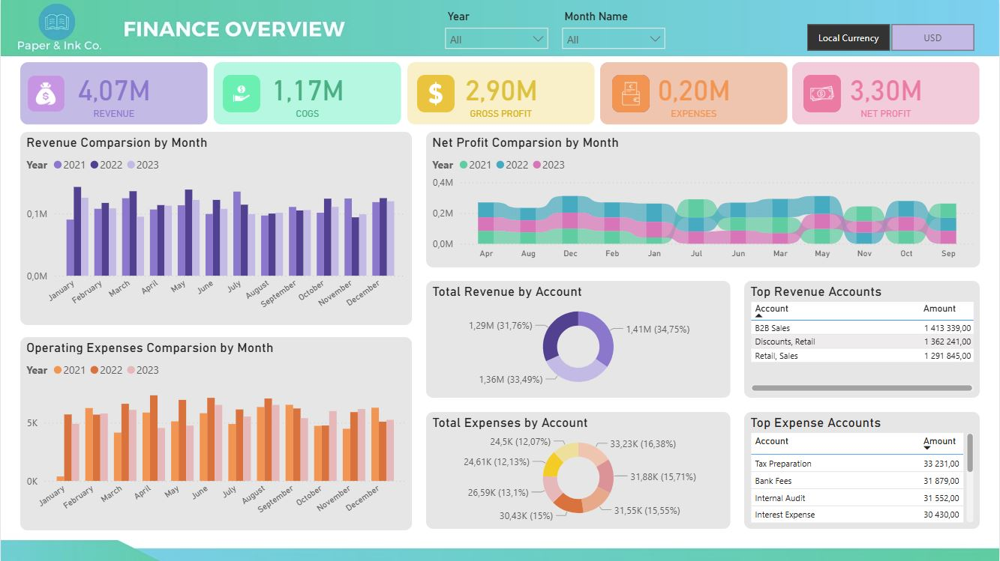

# /About/

Hi, my name is Ewa. I am a certified Microsoft Power BI Data Analyst with a strong focus on data visualization, reporting, and insight generation. My professional background includes over 10 years of experience in the financial sector, where I developed a deep understanding of complex systems, business processes, and data-driven decision making while working as an Application Support Analyst. 

My core expertise lies in transforming raw data into actionable insights through <B>Power BI</B>, <B>DAX</B>, <B>SQL</B> and <B>graphic applications</B>. I have successfully designed and implemented interactive dashboards and automated reporting solutions that support strategic and operational goals. My work combines technical precision with analytical thinking to identify trends, optimize performance, and guide business strategy. 

With a data-first mindset, I bring strong skills in data modeling, data mining, and visual storytelling - enabling stakeholders to make informed decisions based on clear, accurate, and impactful data insights. 

 

# /Portfolio Projects/
## Finance Analysis for Paper & Ink Co.

 *🔗<a href="https://analysteva.github.io/Project4/"> Finance Dashboard </a>*  
  
  👉 [Click here to view the interactive report](https://app.powerbi.com/view?r=eyJrIjoiNmRkMDJjM2MtZjJmYi00MTkwLWE4ZjUtMzYwM2JmMmE5ODQ4IiwidCI6ImVlNDIyMDkzLTBjMGUtNDk4OS05MDkwLWJiNWRjNzMyNzQxYSJ9&pageName=c57da1bc1154c744b370)
  
  

  
## Analysis of the availability and costs of nurseries for children in Poland
 
  *🔗<a href="https://analysteva.github.io/Project1-/"> Nursuries for Children in Poland Project</a>*  

  👉 [Click here to view the interactive report](https://app.fabric.microsoft.com/view?r=eyJrIjoiOWJiODk3YTQtZmJiMC00MmQ0LWIyMzgtM2M5MmFhM2ZkMzA0IiwidCI6ImVlNDIyMDkzLTBjMGUtNDk4OS05MDkwLWJiNWRjNzMyNzQxYSJ9&pageName=afd99852a81e05690553)
  
  

## Analysis of the Coffee Been Sales
 
🔗<a href="https://analysteva.github.io/Project3"> Cofee Bean Sales Project </a> 

   👉 [Click here to view the interactive report](https://app.fabric.microsoft.com/view?r=eyJrIjoiNzk4NjIzZWItM2MxNi00YTk5LThhYjUtMTUxMDZjMzM3N2FkIiwidCI6ImVlNDIyMDkzLTBjMGUtNDk4OS05MDkwLWJiNWRjNzMyNzQxYSJ9&pageName=11b78b4b69e8e30b6a84)
   
   
  
## Analysis of High School Exam Pass Rates in Poland - Matura
 
  *🔗<a href="https://analysteva.github.io/Project2/"> Matura Exam Pass Rates in Poland Project </a>* 

   👉 [Click here to view the interactive report](https://app.fabric.microsoft.com/view?r=eyJrIjoiYzE1NmVjMGItZDM5Yy00YzNiLWEyZmYtOGI0MjAzM2ZkNzliIiwidCI6ImVlNDIyMDkzLTBjMGUtNDk4OS05MDkwLWJiNWRjNzMyNzQxYSJ9&pageName=3df3c32413400e5b6121)
  
  

<!--
## Projects
### Data Professional Survery Breakdown 
<a href="https://github.com/analysteva/Project1-.git">Project 1</a>

<a href="https://analysteva.github.io/Project1-/">Project 2</a> 
-->
